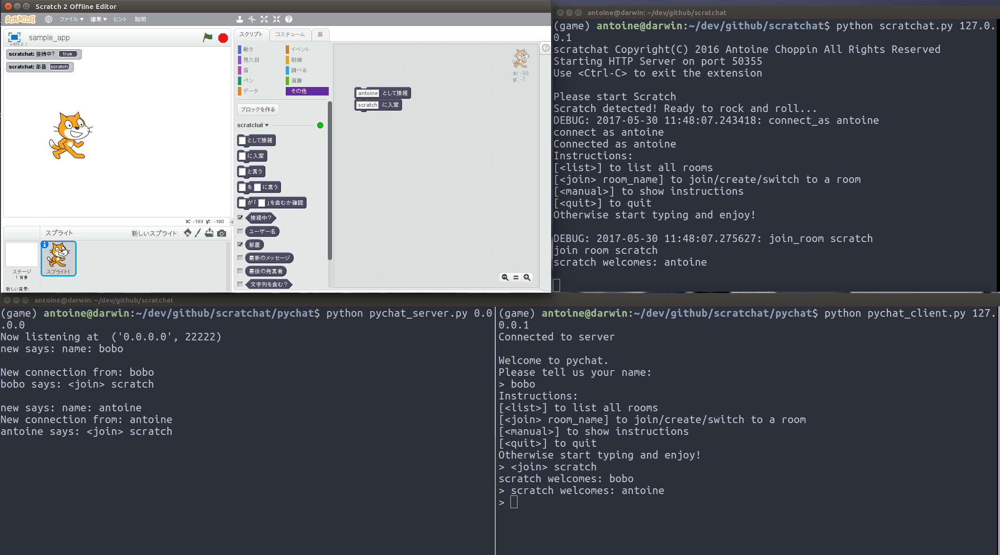
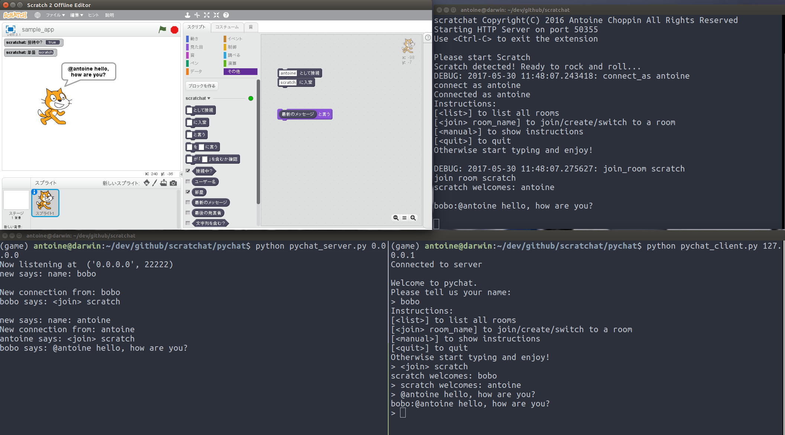
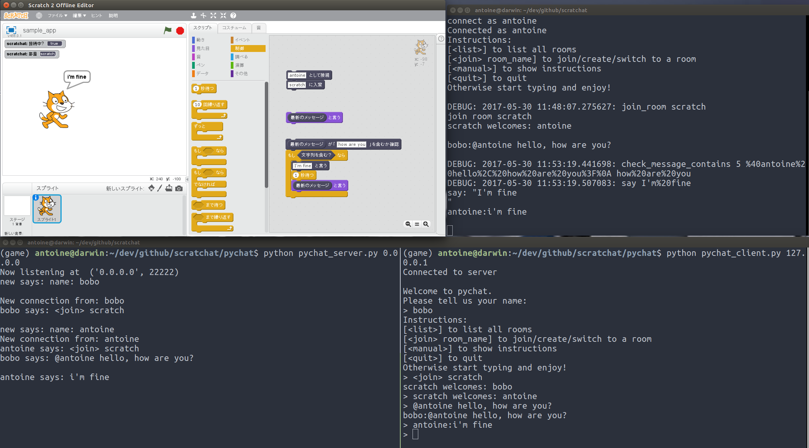

# Scratchat

Scratchat is a Scratch extension based on [PyChat](https://github.com/xysun/pychat) to enable chatting from Scratch.
Since you can send & receive messages, you can create your own chatbot in Scratch.


## Prerequisites

You need:

- Python: Python 3 is better as it supports UTF-8 by default.
- [Scratch 2.0 Offline Editor](https://scratch.mit.edu/scratch2download/)


## Installation & startup

- First clone the repo or download and extract it:
```
$ git clone https://github.com/CoderDojoUtsukidai/scratchat.git
```

- Next, start the chat server:
```
$ cd scratchat/pychat
$ python pychat_server.py 0.0.0.0
Now listening at  ('0.0.0.0', 22222)
```

- In another console, start ```scratchat.py``` and specify the chat server IP address (use 127.0.0.1 if running on the same machine as pychat_server.py):
```
$ cd scratchat
$ python scratchat.py 127.0.0.1
scratchat Copyright(C) 2016 Antoine Choppin All Rights Reserved
Starting HTTP Server on port 50355
Use <Ctrl-C> to exit the extension

Please start Scratch
```

- Start Scratch 2.0 Offline Editor

- While holding the ```shift``` key, in the "File" menu, select "Import experimental HTTP extension" and open scratchat.s2e file

You should see scratchat blocks appear under "More Blocks".


## How to use

- Before starting to chat, you need to:
1. connect to the chat server by specifying your username (use the ```"connect as []"``` block)
2. enter a chat room (use the ```"join room []"``` block)

You can choose your username, but it should not be the same as other users.
You can specify any name for the room, but you will see messages only from users in the same room.



- Next, you can start chatting, e.g. using the ```"say []"``` block.
Anything you say will be sent to the chat server and visible by other users connected to the server and who are in the same chat room.

- You can check the latest message received using the block ```"(last message)"```.



- A block is also provided to check whether a string contains a given substring.  This is useful for checking the messages you receive and react to them.  Due to a limitation in Scratch 2.0 Offline Editor, you need to first call the block ```"check if [] contains []"```, then immediately after, use the result by including the block ```"<contains text?>"```.




## Other features

- You can say something "to someone", which is the same as prefixing the message by @other_user_handle (note: the message must start with the user handle, @xyz including in the middle or at the end of a message will not be considered as a message to @xyz, but just a mention)

- You can check the last message that was sent to a given user (or to yourself)

- You can check the connexion status, your own username (my handle) and the room you are in


## Sample app

Download and check the [sample app](sample_app.sb2) for a simple chatbot that answers "how are you?" by "I'm fine".


## License

Scratchat is based on the work of others and is licensed under the LGPL 2.1 license (or later).

Feel free to contribute to improve the software.


---

scratchat Copyright(C) 2016 Antoine Choppin All Rights Reserved


